# RikkaHub使用教程
## 下载APP
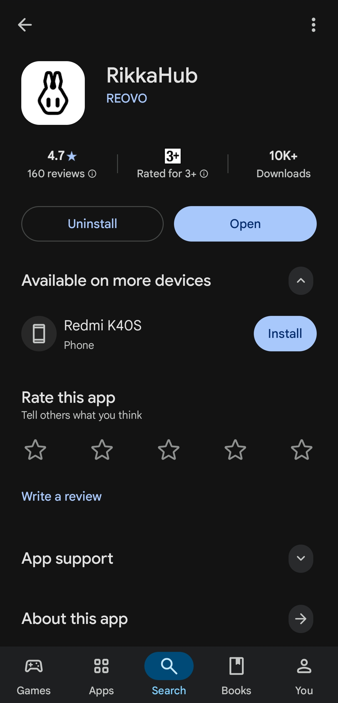
## 主页

## 设置
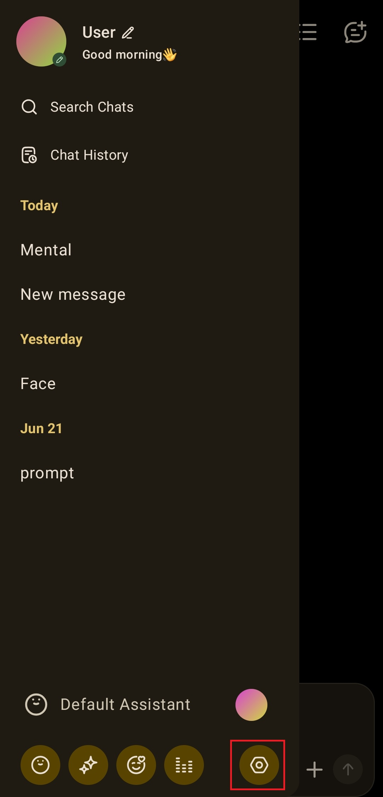
## 添加中转站
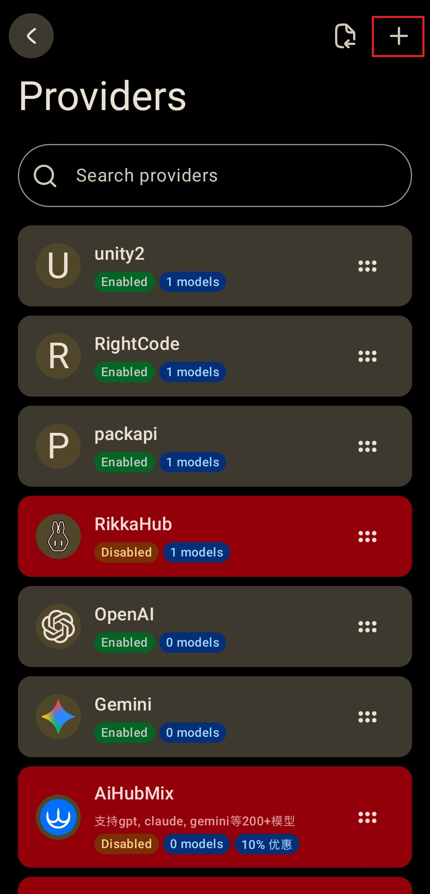
## 设置API
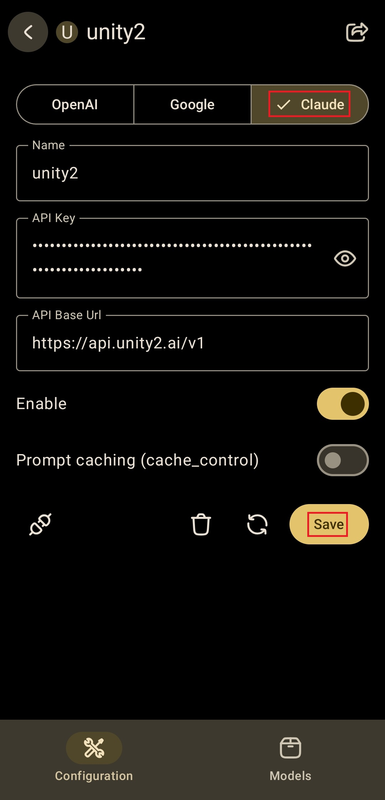
## 添加模型
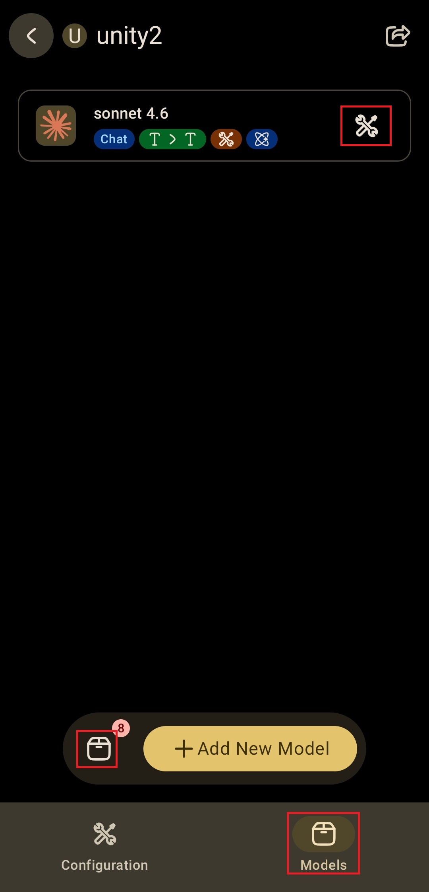
## 设置模型功能
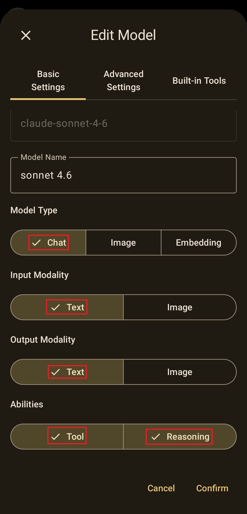
## 设置思考模式
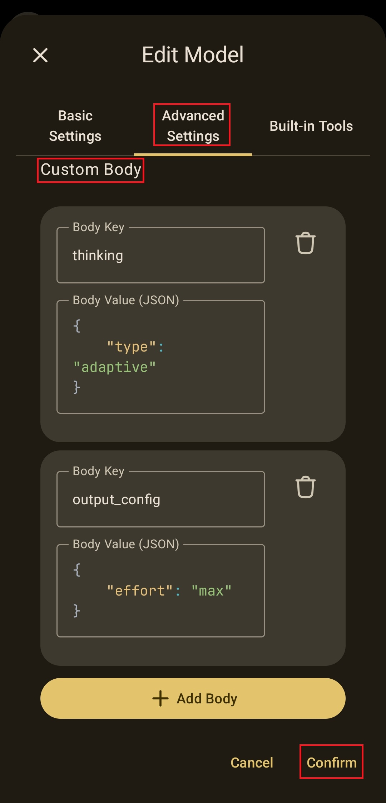
`thinking`  
```
{  
type: "adaptive"  
}  
```
`output_config`  
```
{  
effort: "max"  
}  
```
`cache_control`  
```
{  
type: "ephemeral"
}  
```
## 模型选择
回到主页
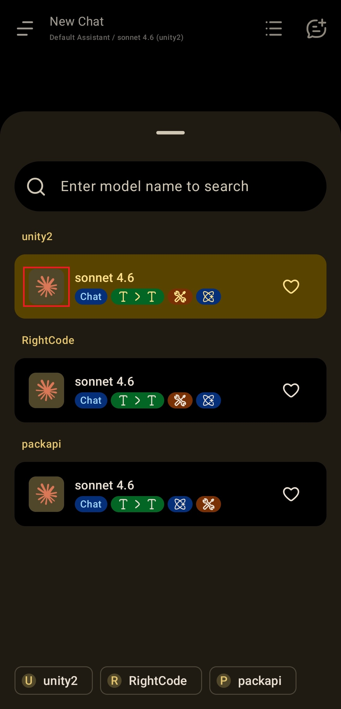
## 关闭冲突思考模式
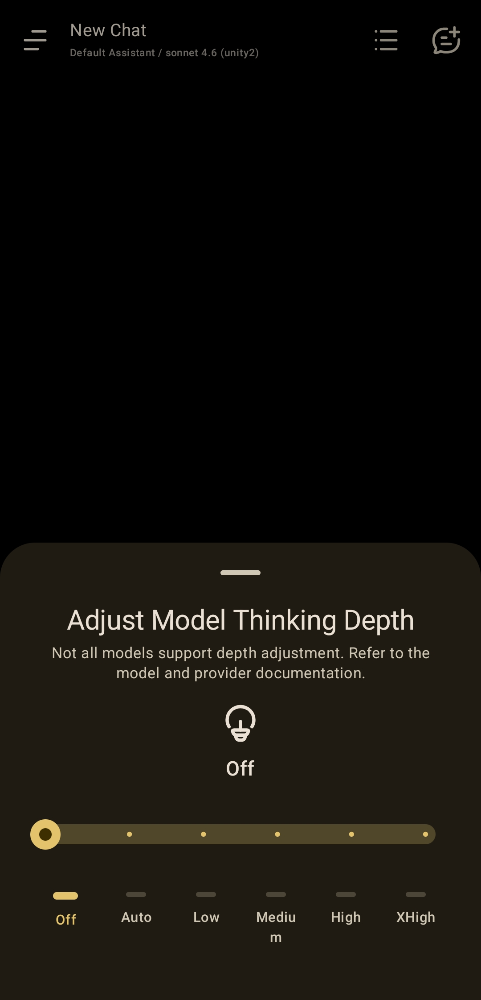
## 设置提示词(可选)
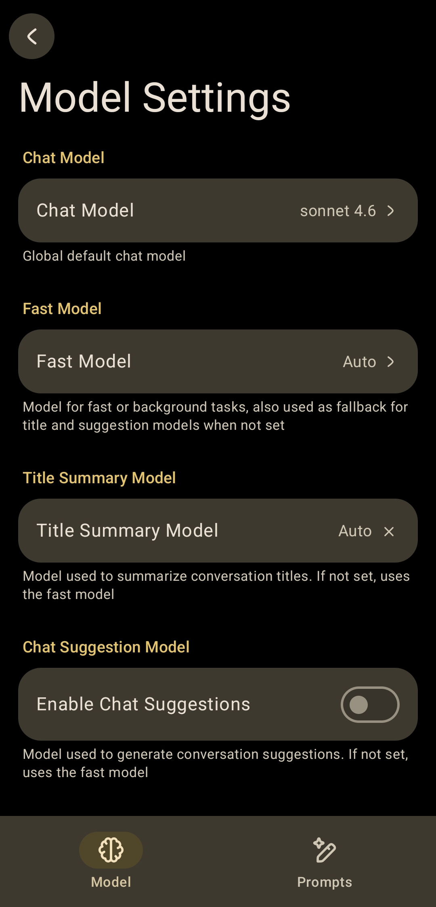
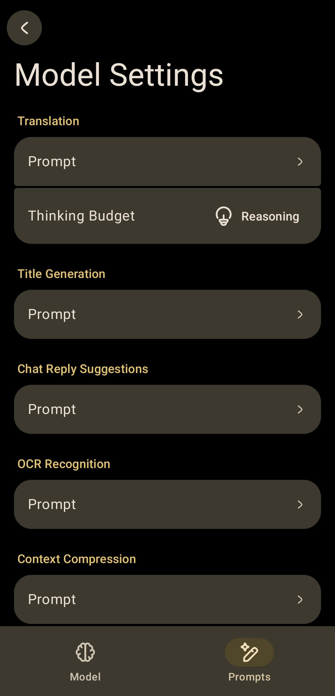
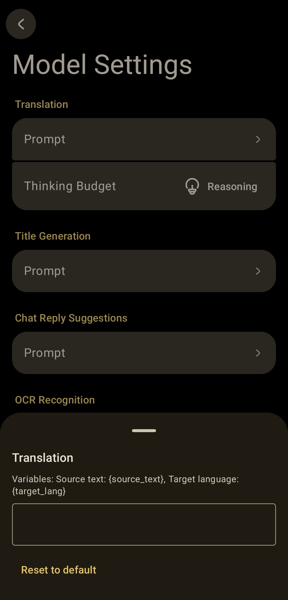
